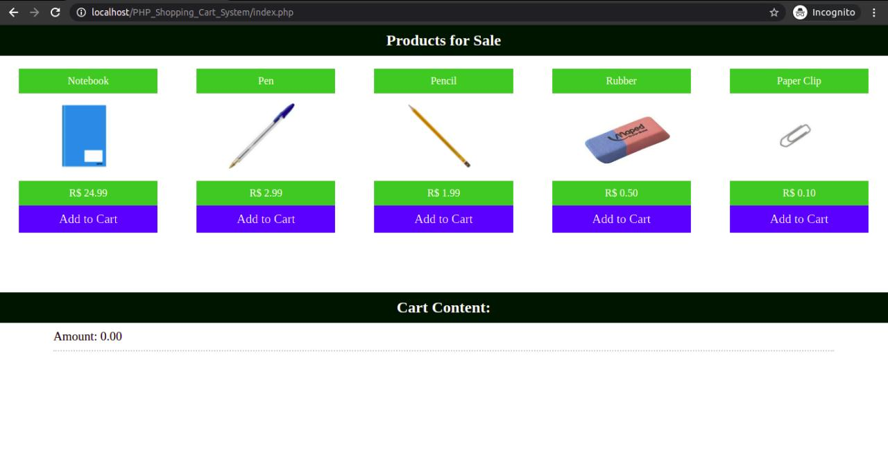
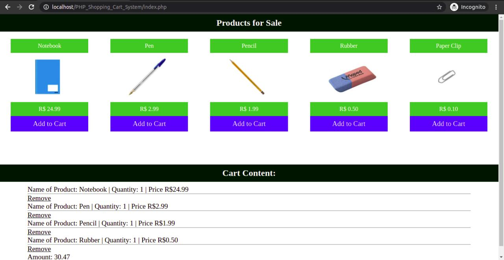
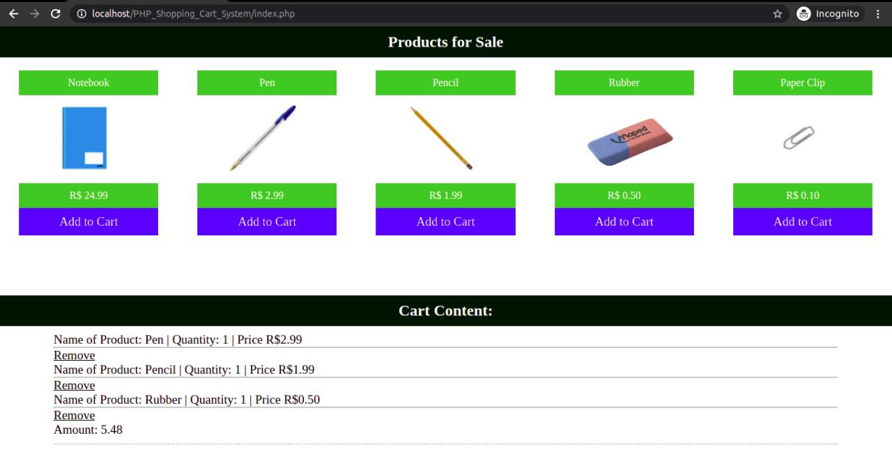

# PHP_Shopping_Cart_System
Sistema de Carrinho de Compras em PHP sem o uso de Banco de Dados. Os códigos foram testados em um Servidor Local (localhost) configurado com Apache.

O objetivo era apenas aplicar as validações e criar o básico de um Sistema de Carrinho de Compras. Não possui cadastro pois não foi utilizado um Banco de Dados (MySQL) e também não possui uma sessão para finalizar a compra.

